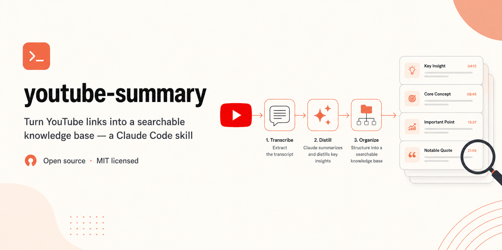

<p align="center">
  
</p>

# YouTube Knowledge Base Skill for Claude Code

[](https://docs.anthropic.com/en/docs/claude-code)
[](https://www.anthropic.com/news/skills)
[](https://www.python.org/)
[](tests/)
[](LICENSE)
[](https://github.com/veryCoolTimo/youtube-summary-skill/pulls)

A skill that turns YouTube links into a structured, searchable knowledge base. Share a link with Claude and it grabs the captions (or transcribes locally with Whisper), distills a structured card with an LLM, files it into your topical taxonomy, commits it to git, and indexes it for retrieval. Ask about your saved videos later and Claude answers from the cards — with timecoded deep-links and screenshots. No coding required.

The mechanical pipeline is deterministic (plain Python scripts). The agent only chooses the engine and reads results, so there is no drift and no duplicates: re-sending a link never creates a second card.

## Install

**Prerequisites:** Python 3.11+, `ffmpeg`, `git`, and Node.js on `PATH` (yt-dlp uses it to solve YouTube's JS challenges). For the default distill engine you need an [OpenRouter](https://openrouter.ai/) API key; for the fully local engine, a running [ollama](https://ollama.com/). You also need a separate git repository for the knowledge base itself (your notes live there, not in this repo).

```bash
# 1. clone the skill
git clone https://github.com/veryCoolTimo/youtube-summary-skill.git
cd youtube-summary-skill

# 2. create the environment
python3 -m venv .venv
.venv/bin/pip install -r requirements.txt

# 3. configure
cp config.example.yaml config.yaml   # set kb_repo (path to your notes repo) and, if needed, models

# 4. register as a Claude Code skill
ln -s "$(pwd)" ~/.claude/skills/youtube-summary
```

Restart Claude Code. The skill loads automatically whenever you share a YouTube link.

## What you can do

Talk to Claude naturally — the skill activates on its own:

> "Save this: https://youtu.be/VIDEO_ID"

> "Add these three videos to my knowledge base" *(paste the links — they're processed in one batch, one git commit)*

> "Put this one under skills/frontend" *(moves an already-saved card without re-summarizing)*

> "Which saved video covered MCP design? What were the key points?"

> "What did I save this week about startups?"

Or run the pipeline directly:

```bash
.venv/bin/python -m scripts.yt_core "https://youtu.be/VIDEO_ID" --config config.yaml
# flags: --engine openrouter|local|self · --category top/sub · --force · --no-push
.venv/bin/python -m scripts.kb_query "your question" --config config.yaml
.venv/bin/python -m scripts.kb_query --recent 10 --top skills --config config.yaml
```

## What a card looks like

Every video becomes a markdown card in your notes repo, filed as `<top>/<sub>/<date>-<slug>.md`:

```markdown
---
title: "Building MCP Servers That Don't Suck"
channel: "Dev Talks"
url: https://youtu.be/VIDEO_ID
verdict: digest_enough
top: skills
sub: ai-agents
---

🎬 Building MCP Servers That Don't Suck
   Dev Talks · ⏱ 24:10
🧭 📄 хватит выжимки — смотреть не обязательно

Автор разбирает типичные ошибки при проектировании MCP-серверов...

💡 Главное:
  • Ресурсы вместо тулов для read-only данных [3:42] → https://youtu.be/VIDEO_ID?t=222
  • Схемы аргументов должны быть плоскими [11:05] → https://youtu.be/VIDEO_ID?t=665

📸 Скрины

```

Cards are written in Russian by default — set `distill.language` in `config.yaml` to change the language of the LLM-written text (section labels like «Главное» stay Russian for now).

## Features

- **Captions first, Whisper fallback** — if a video has no captions, it's transcribed locally with `faster-whisper`; nothing is sent anywhere for transcription
- **Deterministic foldering** — a closed taxonomy from your `taxonomy.yaml` (top-level and subfolders are yours to define); unmatched videos go to `_inbox`, never to a made-up folder
- **Idempotent by video id** — a re-sent link returns "already saved" instantly; `--force` re-processes, `--category` re-files without burning LLM calls
- **Pluggable distill engine** — cloud (OpenRouter), fully local (ollama), or the agent itself
- **Hybrid retrieval** — vector search (chromadb + multilingual embeddings) merged with keyword search over the cards, so exact terms like "MCP" always hit
- **Screenshots** — frames captured at the moments the video actually shows something on screen, embedded into the card
- **One commit per batch** — N links become one git commit and one push, with the push result reported honestly

## Distill engines

| `--engine` | Who writes the summary | Requires |
|---|---|---|
| `openrouter` (default) | Cloud Qwen (free tier) with paid fallback | `OPENROUTER_API_KEY` |
| `local` | Local `gpt-oss-20b` — distill **and** classification stay offline | a running `ollama` |
| `self` | The invoking agent, to a fixed schema | nothing |

Classification, writing, dedup, indexing, and commit are always deterministic — even with `self`. The `self` engine is a two-step protocol: the pipeline emits a prompt file, the agent writes the card JSON, and the pipeline continues with `--card-file`.

## Configuration

All options live in `config.yaml` (git-ignored, per machine):

| Key | What it does |
|---|---|
| `kb_repo` | path to your knowledge-base git clone (required) |
| `env_file` | optional file with `OPENROUTER_API_KEY=...`; empty = read the environment |
| `distill.engine` / `*_models` | engine and model list (first that answers wins) |
| `distill.language` | language the cards are written in (`ru` by default) |
| `captions.languages` | caption preference order (`[ru, en]` by default) |
| `whisper.model` | `medium` by default, `large-v3` for tougher audio |
| `vector.*` | vector store path and embedding model |
| `frames.max_per_video` | screenshot cap per video |

## Troubleshooting

| Problem | Fix |
|---|---|
| `config error: set kb_repo` | point `kb_repo` in `config.yaml` at your notes repo clone |
| every video fails with "no transcript" | check Node.js is installed — yt-dlp needs it for YouTube's JS challenges |
| search returns nothing on a new machine | rebuild the index: `.venv/bin/python -m scripts.reindex --config config.yaml` |
| final line says `"git": "push_failed"` | the card is committed locally; check the notes repo's remote/auth and `git push` manually |
| video landed in `_inbox` | its topic isn't in `taxonomy.yaml` — add a subfolder and re-file with `--category` |
| free OpenRouter model keeps failing | the model list is a fallback chain — add a paid model as the second entry |

## For developers

```
SKILL.md                 # the skill manifest (name, description, agent protocol)
config.example.yaml      # config template
taxonomy.example.yaml    # default folder taxonomy
scripts/
  yt_core.py             # ingest orchestrator + CLI
  transcript.py          # captions → whisper fallback
  distill.py             # LLM distillation (openrouter/ollama/self), JSON retry
  classify.py            # taxonomy classification (override → card hint → LLM)
  frames.py              # screenshot grabbing (yt-dlp stream + ffmpeg)
  kb_writer.py           # card writing, cards.jsonl index, git commit/push
  vectorize.py           # chromadb + fastembed indexing
  kb_query.py            # hybrid retrieval CLI (search / --recent / --top)
  reindex.py             # rebuild the vector index from cards.jsonl
  migrate_kb.py          # one-off migration from a flat index
tests/                   # pytest unit suite (network and models mocked)
```

Run the tests:

```bash
.venv/bin/pytest -q
```

The no-duplicates guarantee is covered in `tests/test_kb_writer.py` and `tests/test_yt_core.py`; the ingest CLI contract (statuses `ok / exists / refiled / need_card / failed`, one commit per batch) in `tests/test_yt_core.py`.

## License

MIT — see [LICENSE](LICENSE).
